# DemoHestia

This repo is mainly established for demonstrating and field testing the
application of [ZORALab's Hestia](https://hestia.zoralab.com) Project. Moreover,
it is also being used for generating the necessary getting started
documentations for that project itself.

## License
This project is licensed under [MIT License](LICENSE).
